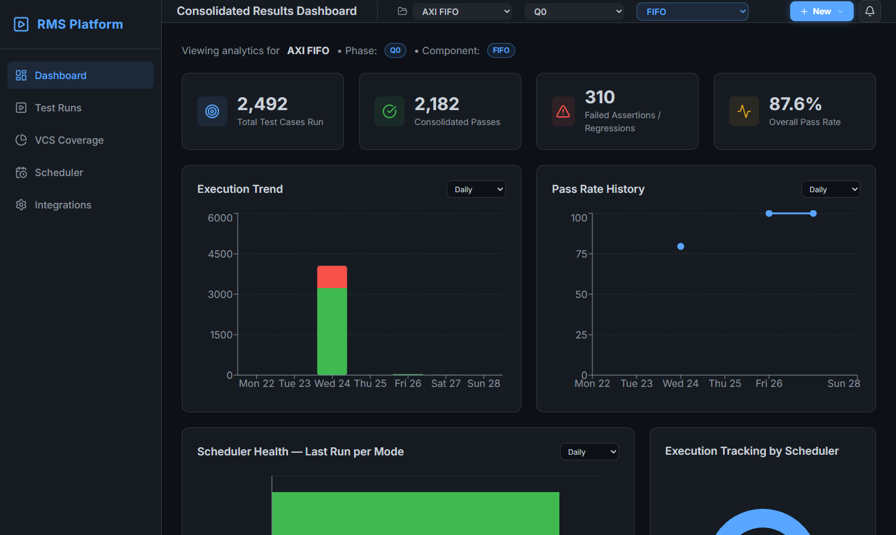
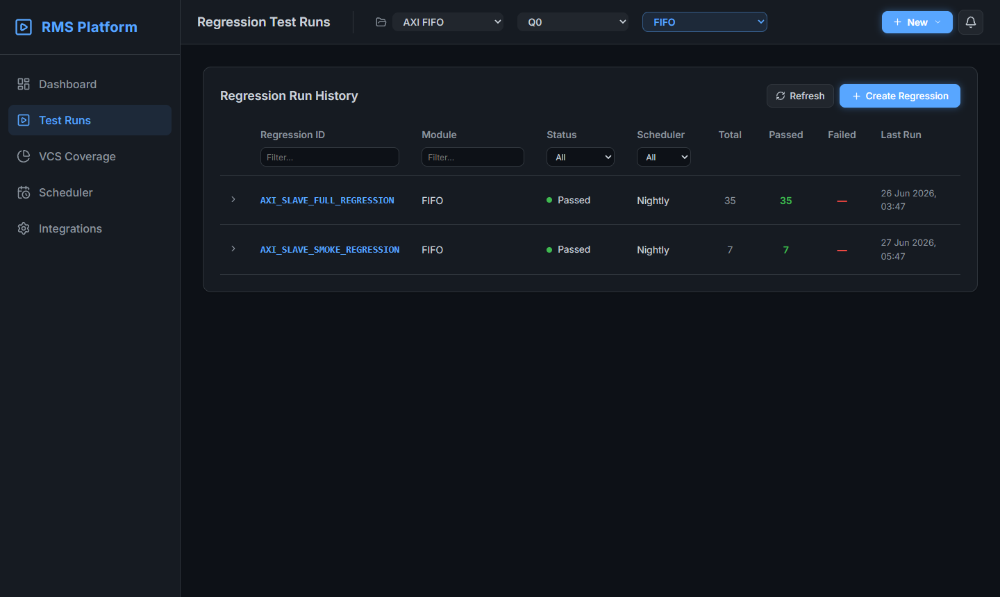
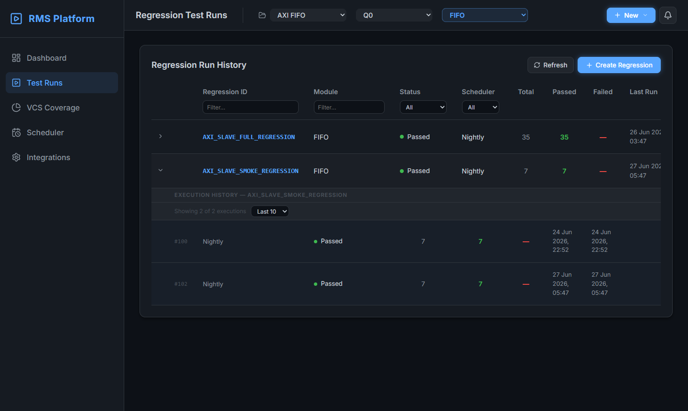

# UI Showcase — VERIF RMS

A page-by-page walkthrough of the Regression Management System with real screenshots.

---

## Dashboard

> **Project:** AXI FIFO &nbsp;|&nbsp; **Phase:** Q0 &nbsp;|&nbsp; **Component:** FIFO &nbsp;|&nbsp; **Duration:** Daily



### Summary Cards

The four cards at the top reflect the **last execution of each regression**, summed — not all-time totals.

| Card | Description |
|------|-------------|
| **Total Test Cases Run** | Sum of `total_tests` from the most recent run of each regression |
| **Consolidated Passes** | Sum of `passed_tests` from those last runs |
| **Failed Assertions / Regressions** | Sum of `failed_tests` from those last runs |
| **Overall Pass Rate** | `passed / total × 100%` |

### Execution Trend

A stacked bar chart showing passed (green) and failed (red) test counts per time bucket.  
Bucket modes: **Daily** (7 days) · **Weekly** (4 weeks) · **Bi-weekly** (4 periods) · **Monthly** (6 months).

### Pass Rate History

A line chart of pass rate over time.  
Days with no executions show a **gap** — no false 0% dot is inserted.

---

## Test Runs

> Searchable, filterable table of all registered regressions.



### Columns

| Column | Description |
|--------|-------------|
| Regression ID | Unique key — also used with `push_result.py --id` |
| Module | Component the regression targets |
| Status | `Passed` · `Failed` · `Scheduled` · `Running` |
| Scheduler | Daily / Weekly / Bi-weekly / Monthly / Nightly |
| Total | Total tests from the last execution |
| Passed | Passed tests from the last execution (green) |
| Failed | Failed tests from the last execution (red) |
| Last Run | Timestamp of the most recent execution |

---

## Execution History (Expanded Row)

Click the **›** arrow on any row to expand its full execution history inline.



- Header shows: **EXECUTION HISTORY — `<REGRESSION_ID>`**
- Counter shows: `Showing X of Y executions`
- Limit dropdown: `Last 10` (default) · `Last 25` · `Last 50` · `All`
- Rows are numbered (`#100`, `#102`, …) and show Status, Total, Passed, Failed, Start/End times

---

## Push Script

Submit results from any CI/CD pipeline after a regression completes:

```bash
python backend/scripts/push_result.py \
  --id    AXI_SLAVE_FULL_REGRESSION \
  --total  35                        \
  --passed 35                        \
  --failed 0
```

**Successful output:**

```
✅ Result pushed successfully
   Regression : AXI_SLAVE_FULL_REGRESSION
   Status     : passed
   Total      : 35
   Passed     : 35
   Failed     : 0
   Pass Rate  : 100.0%
   Executed At: 2026-06-26T03:47:11
```

**Regression not found:**

```
❌ 404 – Regression 'NEW_SUITE' not found.
   Create it via the GUI first, then push results.
```

> The script cannot create regressions — use **+ Create Regression** in the Test Runs page first.

---

## Create Regression

Click **+ Create Regression** in the top-right toolbar on the Test Runs page.

| Field | Description |
|-------|-------------|
| **Regression ID** | Unique key — used with `push_result.py --id` |
| **Module** | Component (populated from project settings) |
| **Phase** | Q0 / Q1 / Q2 etc. (populated from project settings) |
| **Scheduler** | Sets the trend chart bucket on the Dashboard |

---

## Scheduler Health & Execution Tracking

Visible at the bottom of the Dashboard:

- **Scheduler Health — Last Run per Mode** — bar chart showing pass/fail counts per scheduler type from its most recent execution
- **Execution Tracking by Scheduler** — pie/donut chart of test distribution across schedulers

---

## Coverage *(coming soon)*

Will track functional coverage snapshots per component with trend over time.

---

## Scheduler *(coming soon)*

Will configure and display scheduled regression jobs with next-run times.

---

## Integrations / Settings *(coming soon)*

Per-project configuration for:
- CI/CD host and job path (e.g. Jenkins)
- Slack webhook for pass/fail notifications
- Email distribution list
